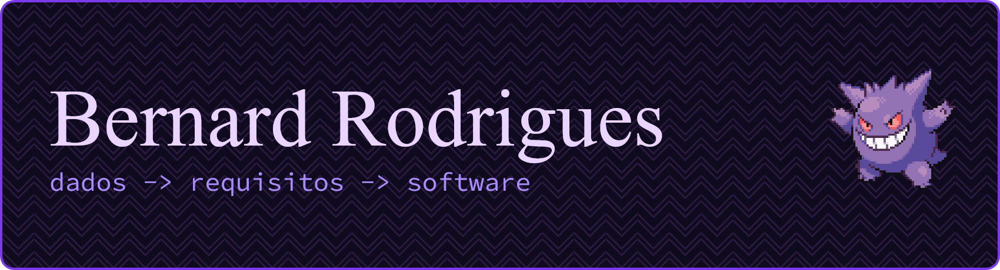
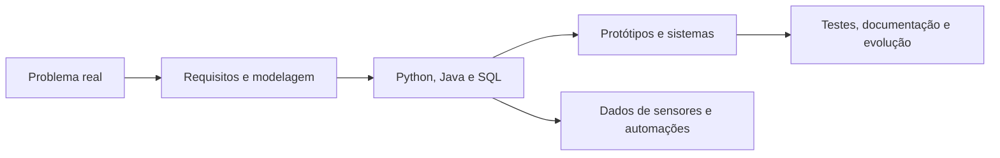

<div align="center">



### Transformo dados, requisitos e ideias em sistemas que rodam no mundo real.

Estudante de Informática no **IFES Campus Cachoeiro de Itapemirim** e bolsista de Iniciação Científica **ICT/SIGFAPES**, explorando o encontro entre sensores, dados e software.

<p>
  <a href="mailto:andradebernard10@gmail.com">
    
  </a>
  
  
</p>

</div>

---

## Olá, eu sou o Bernard

Gosto de construir soluções que conectam problema, dado e código: microcontroladores, sinais Wi-Fi, bancos de dados, automações e documentação que ajuda outras pessoas a entenderem o caminho.

Hoje meu foco está em **IoT**, **análise de dados**, **bancos de dados** e **engenharia de software aplicada**. No meio disso tudo, tenho um interesse especial por automação, ferramentas assistidas por IA e projetos que unem pesquisa com implementação de verdade.

```txt
bernard@lab:~$ foco --atual
> Wi-Fi CSI para caracterização não destrutiva de materiais
> Análise e organização de dados experimentais
> Modelagem com requisitos, UML, OOP e ORM
> Automação de fluxos com ferramentas de IA
```

## Meu território



## Stack que uso para fazer acontecer

**Linguagens e dados**


**Software, modelagem e dados**


**Infraestrutura e embarcados**


## Em destaque

| Frente | O que representa | Tecnologias |
| --- | --- | --- |
| **Pesquisa SIGFAPES/ICT** | Metodologia com sinais Wi-Fi para identificar composição mineral em materiais ornamentais sem destruir a amostra. | ESP32, CSI, Python, análise de dados |
| **Comunicação MQTT com Docker** | Estudo prático de redes com arquitetura publisher/subscriber, broker Mosquitto e cliente Python. | Docker, MQTT, Python |
| **Engenharia de software aplicada** | Base em requisitos, modelagem, orientação a objetos, banco de dados e documentação técnica. | Java, SQL, UML, ORM |

## Como eu costumo trabalhar

- Começo entendendo o fenômeno: sensor, ambiente, ruído, restrição e objetivo.
- Quebro o sistema em módulos pequenos para testar, trocar e evoluir sem bagunça.
- Valido ideias com dados, métricas e experimentos, não só com intuição.
- Documento decisões técnicas para que o projeto continue respirando depois da entrega.
- Uso IA como parceira de fluxo: para revisar, automatizar, comparar caminhos e acelerar protótipos.

## Agora na bancada

| Frente | Status |
| --- | --- |
| Aquisição e análise de dados CSI | Em desenvolvimento na bolsa SIGFAPES |
| Organização de dados experimentais | Estruturação, validação e comparação de resultados |
| Fundamentos de engenharia de software | Requisitos, modelagem, banco de dados e documentação |
| Desenvolvimento assistido por IA | Automatizando rotinas e refinando meu fluxo de trabalho |

## GitHub em movimento

<div align="center">
  <picture>
    <source media="(prefers-color-scheme: dark)" srcset="https://github-readme-stats.vercel.app/api?username=BernRM&show_icons=true&theme=transparent&hide_border=true&title_color=C084FC&text_color=E9D5FF&icon_color=A78BFA&count_private=true" />
    
  </picture>
  <picture>
    <source media="(prefers-color-scheme: dark)" srcset="https://github-readme-stats.vercel.app/api/top-langs/?username=BernRM&layout=compact&theme=transparent&hide_border=true&title_color=C084FC&text_color=E9D5FF" />
    
  </picture>
</div>

## Contribuições em movimento

<div align="center">
  <picture>
    <source media="(prefers-color-scheme: dark)" srcset="https://raw.githubusercontent.com/BernRM/BernRM/output/github-contribution-grid-snake-dark.svg" />
    <source media="(prefers-color-scheme: light)" srcset="https://raw.githubusercontent.com/BernRM/BernRM/output/github-contribution-grid-snake.svg" />
    
  </picture>
</div>

---

<div align="center">

### Vamos conversar?

Estou aberto a trocar ideias sobre IoT, análise de dados, pesquisa aplicada e desenvolvimento de software.

**Cachoeiro de Itapemirim, ES - Brasil**  
**IFES Campus Cachoeiro de Itapemirim**

<br />


</div>
